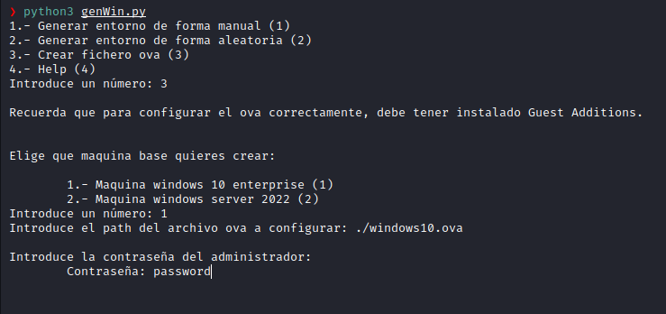
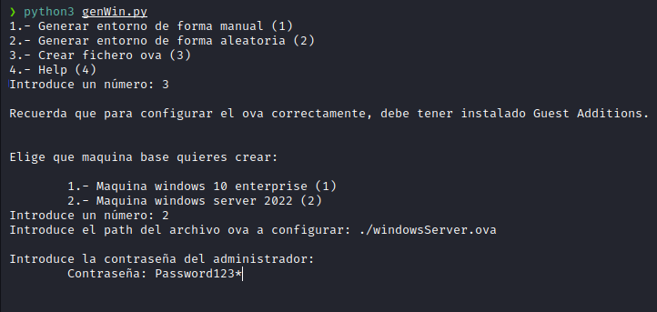
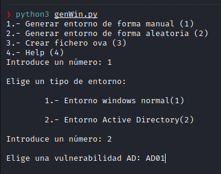

# genWin
 
 **GenWin** es una herramienta para desplegar un entorno AD vulnerable de forma automatizada. El entorno es creado a partir de archivos ova en virtualbox.
 
 Los entornos creados por genwin.py están explicados en el archivo [listaVulerabilidades.txt](./extra/listaVulerabilidades.txt).
 
 Requisitos
 ======
 Todos los entornos han sido configurados sobre un Windows Server 2022 y un Windows 10 Enterprise, por lo que se recomienda su uso para no tener inconvenientes. Además, hace falta instalar lo siguiente:
 * VirtualBox
 * Vboxmanage
 * pwsh
 * steghide
 * figlet
 * python3
 
 Pasos previos 
 ======
 Antes de poder ejecutar la herramienta, hace falta configurar dos archivos ova, uno con Windows Server 2022 y otro con Windows 10 Enterprise. Para ello hay dos opciones:
 1. Descargar los archivos ya configurados de los siguientes enlaces:
 	- Windows 10 Enterprise -> https://drive.google.com/file/d/1VgTg8QotYyTq66W06LO0PS-ejrmvfo7a/view?usp=sharing
	- Windows Server 2022 -> https://drive.google.com/file/d/1iZS8cxENVKeMnua4bSe6Y8epVxdj5giR/view?usp=sharing
 
 2. Crear y configurar los archivos a mano desde cero, ayudándonos de una opción que ofrece el generador.
 
 Estos son los pasos para la segunda opción:
1. Descargar iso:
	- Windows 10 Enterprise -> https://www.microsoft.com/es-es/evalcenter/evaluate-windows-10-enterprise
	- Windows server 2022 -> https://www.microsoft.com/es-es/evalcenter/evaluate-windows-server-2022
2. Configurar iso:
	1. Configurar iso Windows 10 Enterprise:
		- Elegir el idioma por defecto y pulsar next.
		- Elegir el segundo sistema operativo
		- Añadir teclado por defecto, inglés.
		- Añadir segundo teclado a gusto del usuario, en mi caso, spanish(spain)
		- Añadir un usuario cualquiera(administrator@administrator.com) y saldrá un error. Justo debajo saldrá una opción para crear un usuario local, elegimos esa opción y elegimos un usuario cualquiera.
		- Si no podemos poner el @, abajo a la derecha podemos cambiar al otro teclado elegido anteriormente.
		- Terminar configuracion.
		- Ejecutar en powershell:
			- Habilitar usuario administrador -> net user Administrador /active:yes 
			- Añadir contraseña al administrador -> net user Administrador password
		- Desactivar Tamper Protection: Seguridad de windows -> Protección antivirus -> Administrar configuración -> Tamper Protection
		- Añadir guest additions:
			- Pinchar en "Dispositivos" y luego en "Insertar imagen de CD de las guest additions".
			- Abrir el explorador, pinchar en "This PC", Virtualbox guest additions, instalar la opcion amd64 y reiniciar.
		- Crear ova:
			- Apagar la máquina.
			- En la configuración de la maquina, en sistema, poner 1 procesador y 32MB de memoria base. 
			- vboxmanage export nombre_maquina -o fichero.ova
		- Terminar de configurar ova:
			- Ejecutar genwin.py, elegir la tercera opción y el sistema configurará finalmente el ova y lo guardará en el directorio ./ova/winEnterprise.ova.
			
	

	
	

 
 
 	2. Configurar windows server 2022:
		- Elegir el idioma por defecto y pulsar next.
		- Elegir el segundo sistema operativo.
		- Cuidado al poner la contraseña. Mirar la contraseña antes de darle a next. Contraseña recomendada -> Password123*
		- Añadir segundo teclado: Language Settings -> Add language e instalar. Cuando termine, se podra cambiar abajo a la derecha.
		- Añadir guest additions:
			- Pinchar en "Dispositivos" y luego en "Insertar imagen de CD de las guest additions".
			- Abrir el explorador, pinchar en "This PC", Virtualbox guest additions, instalar la opcion amd64 y reiniciar.
		- Crear ova:
			- Apagar la maquina.
			- En la configuración de la maquina, en sistema, poner 1 procesador y 32MB de memoria base. 
			- vboxmanage export nombre_maquina -o fichero.ova
					- Terminar de configurar ova:
			- Ejecutar genwin.py, elegir la tercera opción y el sistema configurará finalmente el ova y lo guardará en el directorio ./ova/winServer.ova.
			
	

	
	

	
¿Cómo ejecutar la genWin.py?
======
El programa puede generar un entorno vulnerable de forma aleatoria o s ele pueden pasar las vulnerabilidades que el usuario quiera configurar. Todas las vulnerabilidades configuradas están descritas en el archivo [listaVulerabilidades.txt](./extra/listaVulerabilidades.txt).

